# sahara-icons
Icons for Sahara CAD software

## Icons

| Icon | Name | Label |
|------|------|-------|
| 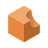 | action_boolean_difference | Boolean Difference |
| 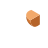 | action_boolean_intersection | Boolean Intersection |
|  | action_boolean_none | Boolean None |
|  | action_boolean_union | Boolean Union |
|  | constraint_angle | Angle Constraint |
| 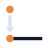 | constraint_coincidence | Coincidence Constraint |
|  | constraint_distance | Distance Constraint |
| 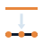 | constraint_divide | Divide Constraint |
| 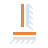 | constraint_horizontal_vertical | Horizontal/Vertical Constraint |
|  | constraint_parallel | Parallel Constraint |
| 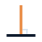 | constraint_perpendicular | Perpendicular Constraint |
| 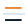 | constraint_symetry | Symmetry Constraint |
|  | tool_chamfer | Chamfer |
| 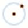 | tool_circle_centre_point | Circle (Centre Point) |
| 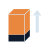 | tool_extrude | Extrude |
|  | tool_fillet | Fillet |
|  | tool_hole | Hole |
| 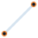 | tool_line | Line |
| 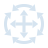 | tool_move_rotate | Move Rotate |
| 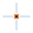 | tool_point | Point |
| 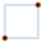 | tool_rectangle_2_point | Rectangle (2 Point) |
|  | tool_revolve | Revolve |
|  | tool_select | Select |
| 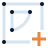 | tool_sketch | Sketch |
| 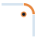 | tool_sketch_fillet | Sketch Fillet |
| 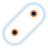 | tool_slot_centre_to_centre | Slot (Centre to Centre) |

## Design Language

Background: `#23456D`

| Colour | Hex | Usage |
|--------|-----|-------|
| Orange | `#E8873D` | Primary subject — the object being acted upon |
| Orange Highlight | `#F2A96A` | Primary subject — highlighted |
| Orange Shadow | `#B5642A` | Primary subject — shaded |
| Dark | `#0F1B2D` | Reference object — the object in relation to |
| Dark Highlight | `#1E3454` | Reference object — highlighted |
| Dark Shadow | `#080E18` | Reference object — shaded |
| Light | `#D6E4F0` | Annotations |

## Prerequisites

[librsvg](https://wiki.gnome.org/Projects/LibRsvg) for SVG to PNG conversion.
Python 3 with Pillow, scipy, and numpy for SDF atlas generation.

macOS:
```bash
brew install librsvg
python3 -m venv .venv
source .venv/bin/activate
pip install -r requirements.txt
```

Debian/Ubuntu:
```bash
sudo apt install librsvg2-bin
python3 -m venv .venv
source .venv/bin/activate
pip install -r requirements.txt
```

Fedora:
```bash
sudo dnf install librsvg2-tools
python3 -m venv .venv
source .venv/bin/activate
pip install -r requirements.txt
```

## SDF Atlas

The build pipeline generates a Signed Distance Field (SDF) texture atlas for efficient, resolution-independent icon rendering in OpenGL.

Each icon is rasterised three times — once per design language colour — to isolate each layer. A distance transform is then applied to each layer, producing a greyscale SDF where values above 0.5 are inside the shape and below 0.5 are outside. The three SDFs are packed into the RGB channels of a single image:

| Channel | Colour | Layer |
|---------|--------|-------|
| R | `#E8873D` | Primary subject |
| G | `#0F1B2D` | Reference object |
| B | `#D6E4F0` | Annotations |

The individual SDF images are then packed into a single texture atlas (`icons/atlas.png`) with a JSON manifest (`icons/atlas.json`) containing pixel coordinates and normalised UV coordinates for each icon.

At render time, a fragment shader samples each channel, applies a smoothstep threshold, and composites the layers with their original colours. This allows icons to scale cleanly to any size without aliasing artefacts.

## Building

Generate all PNGs and SDF atlas:
```bash
make
```

Generate only PNGs:
```bash
make png
```

Generate only SDF textures:
```bash
make sdf
```

Generate atlas:
```bash
make atlas
```

Clean generated files:
```bash
make clean
```
